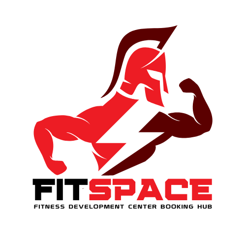

  

# FitSpace: FDC Booking Hub 🏀🏐
The FitSpace: FDC Booking Hub is a console-based Java application designed for students and employees to easily reserve and access gym facilities at the Fitness Development Center, Batstate-U Alangilan Campus.

## Summary of Sections
-  [1. Project Overview](#proj_overview)
-  [2.  Application of OOP](#proj_oop)
-  [3.  Alignment with SDG](#proj_sdg)
-  [4. Usage Guidelines](#proj_guidelines)
-  [5. Technical Solution Framework](#proj_techframework)
 

## <a id = "proj_overview"> 🏋️‍♂️ Project Overview </a> 
The FitSpace: FDC Booking Hub is a console-based Java application designed for students and employees of Batstate-U Alangilan Campus, providing an efficient way to reserve gym facilities at the Fitness Development Center (FDC). Users can browse available facilities, select a reservation date, and choose from six standard time slots. Similarly, the system enables admins to manage users, reservations, and facility details with ease. This streamlined process aims to enhance the accessibility and organization of the campus's, specifically, FDC's recreational spaces.
 

## <a id = "proj_oop"> 🏋️‍♂️ Application of OOP </a> 
**FitSpace** implements core Object-Oriented Programming (OOP) principles to ensure efficient user management and system functionality through the following OOP principles:

### OOP Principles Applied
1. **Encapsulation**:  
  Encapsulation is used by making fields like firstName, password, and uniqueId in the User class, and facilityID, name, and status in the Facility class private. Public methods like registerUser, loginUser, and getters control access to these fields, ensuring data integrity and security by restricting direct modification of the object's internal state.

2. **Inheritance**:    
   Inheritance is applied in the Student and Employee classes by extending the User base class. These derived classes inherit properties like userId, uniqueId, and password, as well as methods such as registerUser(), loginUser(), and displayCommonHeader(). This allows the student and employee classes to reuse the common functionality from the User class, while also enabling them to have their specific behavior when needed.

3. **Polymorphism**:  
  Polymorphism is shown as the Student and Employee classes override methods like registerUser() and loginUser() to provide specific behaviors. The getUserType method returns the appropriate object based on the users input, and Java dynamically selects the correct method based on the object type.

4. **Abstraction**:  
   Abstraction in this implementation is achieved by creating an abstract User class that contains common methods like commonRegistration() and commonLogin() to handle shared functionality (such as database interactions and password validation). The abstract methods displayUserMenu(), registerUser(), and loginUser() are left unimplemented, forcing subclasses (Student and Employee) to provide specific implementations for these behaviors. This ensures that each user type can define its own actions while still adhering to a shared structure. 

## <a id = "proj_sdg"> 🏋️‍♂️ Alignment with SGD </a> 

**FitSpace** contributes to the United Nations' Sustainable Development Goals (SDGs) by promoting physical well-being and quality education through the following SDGs:

### SDGs Fullfilled
1. **SDG 4: Quality Education**  
   The **FDC Booking Hub** contributes to improving access to quality education by providing a platform for students and employees to book gym facilities for both physical activities and academic purposes. FDC is used not only for physical training but also for conducting classes and exams, offering students a versatile learning environment. By integrating educational facilities with a booking system, FDC supports an enhanced learning experience for students, promoting health and wellness alongside academic success.

2. **SDG 3: Good Health and Well-being**  
   The platform supports the health and well-being of students and employees by making it easier to reserve gym facilities for fitness and recreational purposes. Access to well-maintained fitness facilities encourages regular exercise, which improves physical health, reduces stress, and promotes mental well-being. By ensuring convenient access to these resources, the system contributes to the overall health of the university community.
 

## <a id="proj_guidelines"> 🏋️‍♂️ Usage Guidelines </a>

Below are the key features of **FitSpace**:

### Main Menu
1. **User Registration**  
   Allows users to register as either a Student or Employee by providing necessary details like name, role, and password.
2. **User Login**  
   Users can log in as either a Student or Employee while using their credentials stored in the database.
3. **Admin Dashboard Portal**  
   Provides access to an admin interface to manage users, reservations, and facilities.
4. **Exit**  
   Exits the application.

### Student Menu
1. **Make a Reservation**  
   Students can book a reservation for gym facilities.
2. **View My Reservation**  
   Students can view their reservation details and cancel them if necessary.
3. **Log-out**  
   Students can log out from the system.

### Employee Menu
1. **Make a Reservation**  
   Employees can book a reservation for gym facilities.
2. **View My Reservation**  
   Employees can view their own reservation and cancel it if necessary.
3. **View All Reservations**  
   Employees can view all reservations made by other users.
4. **Log-out**  
   Employees can log out from the system.

### Admin Menu
1. **Manage Users**  
   Admins can view all users and search for a specific user.
2. **Manage Reservations**  
   Admins can view all reservations and modify the reservation status.
3. **Manage Facilities**  
   Admins can add or modify facility status (availability, type, etc.).
4. **Log-out**  
   Admins can log out from the system.
 

## <a id="proj_techframework"> 🏋️‍♂️ Technical Solution Framework </a> 
**FitSpace** is built using the following technologies:

- **Java**: The main programming language used for developing the application. It provides a solid foundation for building an object-oriented system.
- **Visual Studio Code**: The IDE used for writing and debugging the code.
- **MySQL**: The database used to store user data, reservations, and facility information.
  - **MySQL Workbench**: The tool used to manage the database and run SQL queries.
 
