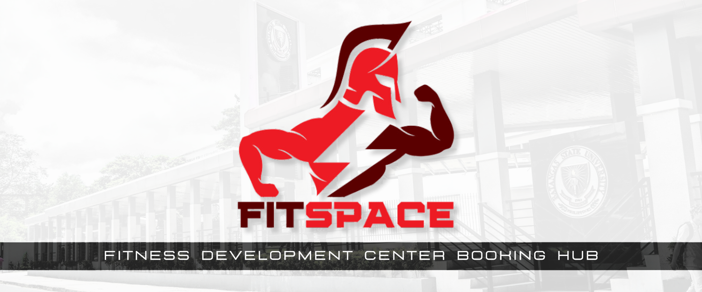
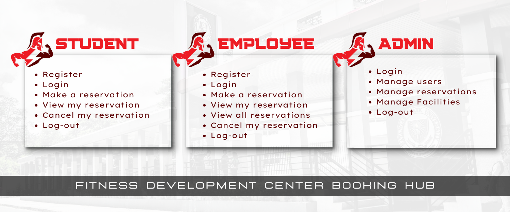

<p align="center">
   
</p>

# FitSpace: FDC Booking Hub 🏀🏐
Welcome to the **FitSpace: FDC Booking Hub Repository**! This repository contains the complete code and resources for this Java console application. The project is designed for students and employees of Batangas State University - Alangilan Campus, allowing them to efficiently reserve gym facilities at the Fitness Development Center.

Explore this repository to learn more about how the system works and how I applied object-oriented programming concepts to create a functional and efficient booking system! 💻🏋

# 🏸 Summary of Sections
💻 [**1. Project Overview**](#proj_overview)  
💻 [**2. Application of OOP**](#proj_oop)  
💻 [**3. Alignment with SDG**](#proj_sdg)  
💻 [**4. Usage Guidelines**](#proj_guidelines)  
💻 [**5. Project Development**](#proj_dev)  
💻 [**6. Acknowledgement**](#proj_acknowledge)  
💻 [**7. Project Developer**](#proj_developer)  
<br>

# <a id = "proj_overview"> 🏸 Project Overview </a> 
 **FitSpace: FDC Booking Hub** is a Java console program designed for students and employees of **Batstate-U Alangilan Campus**. It streamlines facility reservations at the **Fitness Development Center**, allowing users to view available facilities, book slots, and track usage. The system ensures organized management of reservations, monitors facility conditions, and enables quick communication for maintenance. Admins can manage users, reservations, and facilities, improving access and fostering a more active campus community.

---
### 🌟 Project Objectives 🌟  
&nbsp;&nbsp;&nbsp;&nbsp;🎯 **Convenience:** Simplify the reservation process for gym facilities, saving time and effort.  
&nbsp;&nbsp;&nbsp;&nbsp;🎯 **Organization:** Keep a structured record of facility usage and reservations.  
&nbsp;&nbsp;&nbsp;&nbsp;🎯 **Monitoring:** Assist in tracking the condition and availability of gym facilities.  
&nbsp;&nbsp;&nbsp;&nbsp;🎯 **Communication:** Enable efficient user notification in case of issues or maintenance needs.  
&nbsp;&nbsp;&nbsp;&nbsp;🎯 **Admin Support:** Provide tools for admins to manage users, facilities, and reservations effectively.
<br>

---

# <a id = "proj_oop"> 🏸 Application of OOP </a> 
**FitSpace: FDC Booking Hub** is built around the fundamental principles of **Object-Oriented Programming (OOP)**, ensuring both efficient functionality and smooth user experience. By applying these principles, the system achieves a scalable and organized structure that facilitates easy management and smooth operation of the booking process. 

---
## ☕ **Encapsulation**  
   - **Private Fields**: The User class uses private fields such as firstName, password, and uniqueId, while the Facility class uses private fields like facilityID, name, and status. Similarly, in the Admin class, the fields adminID and adminPass are kept private. This ensures that sensitive information is not directly accessible from outside the class, protecting the integrity of the data.
   - **Public Methods**:  Methods like registerUser(), loginUser(), and getters control access to these fields, ensuring data integrity and security by preventing direct modification of the object's internal state. In Admin.java, methods like getAdminID() and getAdminPass() allow controlled access to the adminID and adminPass fields.
---
## ☕ **Inheritance**  
   - **Base Class**: The Student and Employee classes extend the User base class, inheriting common properties (userId, uniqueId, password) and methods (registerUser(), loginUser(), displayCommonHeader()).  
   - **Customization**: These subclasses allow customization of behavior while reusing common functionality from the User class.
---
## ☕ **Polymorphism**  
   - **Overridden Methods**: The Student and Employee classes override methods like registerUser() and loginUser() to implement specific behaviors for each user type.  
   - **Dynamic Method Selection**: The getUserType() method returns the correct object based on user input, and Java dynamically selects the appropriate method based on the object type.
---
## ☕ **Abstraction**  
   - **Abstract Class**: The User class is abstract, containing shared methods like commonRegistration() and commonLogin(). These methods handle functionality such as database interactions and password validation.  
   - **Abstract Methods**: Methods like displayUserMenu(), registerUser(), and loginUser() are left unimplemented, forcing the subclasses (Student, Employee) to define their specific implementations. This ensures that each user type can define its own actions while following a common structure.
---
# <a id = "proj_sdg"> 🏸 Alignment with SDGs </a> 

**FitSpace** contributes to the **United Nations' Sustainable Development Goals (SDGs)** by promoting physical well-being and quality education through the following SDGs:

### 🌍**SDG 4: Quality Education**  
> FitSpace **enhances access to education** by allowing students and employees to reserve gym facilities for both fitness and academic purposes, such as classes and exams. This integration of educational and fitness spaces improves the student experience, supporting academic success and overall well-being.

### 🌍**SDG 3: Good Health and Well-being**  
> FitSpace **promotes the health and well-being** of students and employees by simplifying access to gym facilities, encouraging regular exercise, reducing stress, and boosting mental health, ultimately supporting the overall well-being of the university community.
<br>

---

# <a id="proj_guidelines"> 🏸 Usage Guidelines </a>
### 🌟 **Prerequisites** 🌟

Before you start using **FitSpace**, make sure you have the following:

1. **Unique ID**:  
   - **Students**: Your SR code 
   - **Employees**: Your employee ID 
   This is required for registration and login.
   
2. **Integrated Development Environment (IDE)**:  
   - **Visual Studio Code** or any other compatible IDE for editing and running the Java code.

3. **Java**:  
   - Ensure **Java** is installed on your system to run the application.  
   - Recommended version: **Java 8** or higher.

---
### 🌟 **User Manual** 🌟
**FitSpace** is designed with user-friendly features to ensure a seamless experience for all. Below are the key features and how to use them:

<p align="center">
   
</p>

---


| **Feature**               | **Who Can Access**      | **How to Use**                                                                                                                                                      |
|---------------------------|-------------------------|----------------------------------------------------------------------------------------------------------------------------------------------------------------------|
| **1️⃣ User Registration**  | Students, Employees     | - Select your role (**Student** or **Employee**).<br> - Enter your **full name**, **role-specific ID** (SR code for students, Employee ID for employees), and a **secure password**.<br> - Submit your details to complete the registration. |
| **2️⃣ User Login**         | All users| - Enter your **Usnique ID** (SR code, Employee ID, or Admin ID).<br> - Provide your **password**.<br> - Access features based on your role.|
| **3️⃣ Reservation Management** | Students, Employees     | - Navigate to the **Reservation Section** after logging in.<br> - Select a facility and pick an available time slot.<br> - Confirm your reservation or view your **reservation history** to cancel or update. |
| **4️⃣ Admin Dashboard**    | Admins                  | - Log in with the provided Admin credentials.<br> - Use the dashboard to:<br>    - **Manage Users:** Add, update, or delete accounts.<br>    - **Manage Reservations:** Approve or cancel requests.<br>    - **Manage Facilities:** Update facility details or availability. |
| **5️⃣ Log-out**            | All users               | - Click **Log-out** from any screen to securely exit your account.                                                                                                   |


---
### 🌟 **Additional Guidelines** 🌟
**🔻 Security**: Always use a strong password and change it regularly to keep your account secure.  
**🔻 Fair Usage**: Ensure that reservations are made fairly, respecting others' access to facilities.  
**🔻 Availability**: Facilities are subject to availability and will be updated in real-time for users to view.

---


# <a id="proj_dev"> 🏸 **Project Development** </a> 
The development of FitSpace: FDC Booking Hub involved careful planning, implementation, and organization. The project follows a well-structured directory format to ensure efficient management and easy navigation of its components.

---
### 📁**Directory Organization**📁
**Here’s an overview of how the project files are organized:**  
```
FDC Booking Hub/
├── .vscode/
│   └── settings.json
├── database/
│   └── schema.sql
├── lib/
│   └── mysql-connector-j-9.1.0.jar
├── src/
│   ├── main.java
│   ├── utils/
│   │   ├── admin/
│   │   │   ├── admin.java
│   │   │   └── adminManager.java
│   │   ├── database/
│   │   │   └── DBConnection.java
│   │   ├── facilities/
│   │   │   ├── facility.java
│   │   │   └── facilityManager.java
│   │   ├── reservation/
│   │   │   ├── reservation.java
│   │   │   ├── reservationManager.java
│   │   │   └── cancellation.java
│   │   └── users/
│   │       ├── user.java
│   │       ├── userManager.java
│   │       ├── employee.java
│   │       └── student.java
```
### ☕**Classes Overview**☕
**The application consists of well-defined classes, each responsible for specific functionalities:**
| **Class Name**                | **Description**                                                                                          |
|-------------------------------|----------------------------------------------------------------------------------------------------------|
| `main.java`                    | Main entry point of the application, responsible for initializing and running the program.                |
| `admin.java`                   | Class representing an admin user, containing methods and attributes for admin functionality.              |
| `adminManager.java`            | Manages admin-related operations, such as admin login, registration, and management of facilities/users.  |
| `DBConnection.java`            | Handles the connection between the Java application and the database, ensuring smooth data transactions.  |
| `facility.java`                | Represents a facility in the FDC, with attributes such as facility name, type, and availability.          |
| `facilityManager.java`         | Manages the facilities, including adding, removing, and updating facility data.                          |
| `reservation.java`             | Represents a reservation made by users, storing information like the user, facility, and reservation time. |
| `reservationManager.java`      | Manages all reservation-related operations, including creating, viewing, and canceling reservations.       |
| `cancellation.java`            | Handles the cancellation of reservations, including updating the database and notifying users.            |
| `user.java`                    | Abstract class for common user properties and behaviors, shared by both students and employees.           |
| `userManager.java`             | Manages user-related operations, such as registration, login, and user data management.                   |
| `employee.java`                | Represents an employee user, extending the `user.java` class and adding specific functionalities.         |
| `student.java`                 | Represents a student user, extending the `user.java` class and adding student-specific functionalities.   |

---

### 💻**Technical Solution Framework**💻
**To build this project, the following tools and technologies were used:**
- **🔻 Java**: The primary programming language used to develop the application, providing the backbone for the system's logic and functionality.
  
- **🔻 Visual Studio Code**: The integrated development environment (IDE) chosen for writing, debugging, and testing the application's code.

- **🔻 MySQL**: The relational database management system (RDBMS) used to store and manage critical data, including user profiles, reservations, and facility details.
  
- **🔻 MySQL Workbench**: The powerful tool utilized for managing the MySQL database, running queries, and visualizing the database structure.
---

# <a id="proj_acknowledge"> 🏸 **Acknowledgement** </a>
I sincerely thank **Ms. Fatima Marie P. Agdon**, my instructor for **CS 211: Object-Oriented Programming (OOP)**, for her unwavering guidance and support throughout this project. Her commitment to teaching and encouragement greatly contributed to my understanding of object-oriented programming and its practical applications.  

The development of **FitSpace: FDC Booking Hub** was made possible through her mentorship, which inspired me to think creatively, design efficiently, and code purposefully.  

Thank you for being a remarkable mentor and a source of motivation! 💝💻

---

# <a id="proj_developer"> 🏸 **Project Developer** </a>
<p align="center">
   
</p>

I am a **second-year BS Computer Science student** from **CS-2101** at Batangas State University. This project, **FitSpace: FDC Booking Hub**, was created as part of my course **CS-211: Object-Oriented Programming (OOP)**.

As a **student-athlete**, I deeply value the balance between academics and athletics. The challenges I’ve faced in managing time and access to facilities inspired me to develop **FitSpace**, a platform designed to make gym facility reservations seamless and efficient. My goal was to create a system that fosters both physical well-being and academic success by ensuring students and employees can easily access and utilize fitness spaces.

---

### 🌟 **Contact Details** 🌟

&nbsp;&nbsp;&nbsp;&nbsp;📜 **Name:** [Anthonina Dhapniella C. Vael](https://github.com/andavael)  
&nbsp;&nbsp;&nbsp;&nbsp;💻 **GitHub:** [github.com/andavael](https://github.com/andavael)  
&nbsp;&nbsp;&nbsp;&nbsp;📧 **Email:** [23-04485@g.batstate-u.edu.ph](mailto:23-04485@g.batstate-u.edu.ph)  

---

Thank you for exploring **FitSpace**! This project reflects my passion for both **technology** and **sports**, and I hope it serves as a valuable tool for users. Feel free to reach out to me for any queries or collaboration opportunities. 🏐💻
